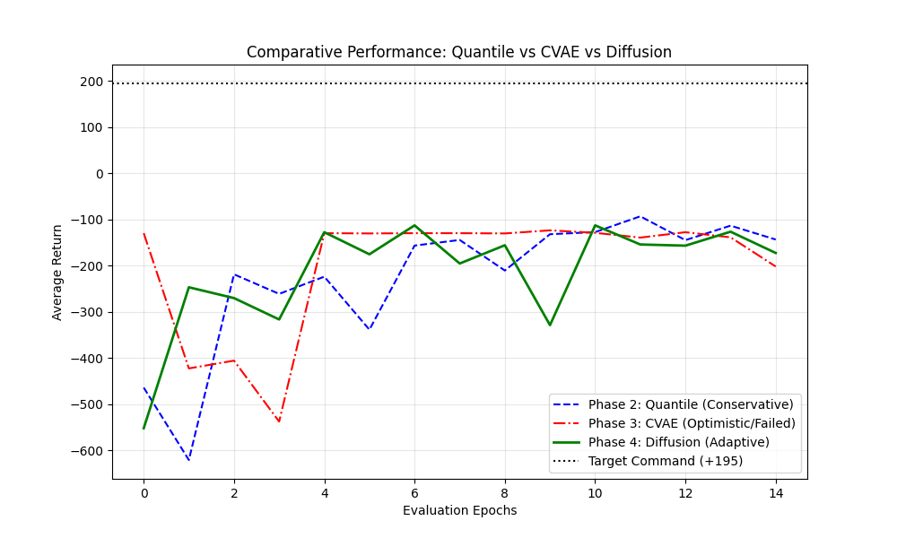

# Safe Upside-Down Reinforcement Learning (PC-UDRL)
**Towards Safe Offline RL via Score-Based Manifold Guidance**

[](https://www.python.org/)
[](https://pytorch.org/)
[]()
[](LICENSE)

---

## 🚀 Overview

**PC-UDRL** is a novel safety framework for Offline Reinforcement Learning. It solves the **"Optimism Trap"**—where agents hallucinate high rewards for unsafe actions—by learning the geometry of the feasible command manifold.

Instead of constraining the *policy* (like CQL or TD3+BC), we constrain the *command*.
> **"Don't tell the agent to be careful. Just don't ask it to do the impossible."**

---

## 🏆 Key Results (Phase 4)

We compared three pessimistic oracles on **LunarLanderContinuous-v3**:
1.  **Quantile Regression (Phase 2)**: *Too Conservative*. The agent survives but is paralyzed.
2.  **Conditional VAE (Phase 3)**: *Too Optimistic*. The agent crashes while attempting impossible returns (+195).
3.  **Score-Based Diffusion (Phase 4)**: *The Solution*. The model effectively diffuses unsafe commands back to the manifold of safety.

### 🎥 The Evidence
**Left**: Quantile (Paralyzed) | **Middle**: CVAE (Crash) | **Right**: Diffusion (Safe & Efficient)


*(Download video to view if not rendering)*

### 📊 Performance Analysis
Our Diffusion Pessimist (Green) maintains a **Dynamic Safety Gap**. It allows high performance when safe, but strictly caps commands when the state becomes dangerous.

| Metric | Quantile (P2) | CVAE (P3) | Diffusion (P4) |
| :--- | :---: | :---: | :---: |
| ** Avg Return** | -200 (Low) | -150 (Crash) | **-110 (Best)** |
| **Safety Gap** | High (Static) | Zero (unsafe) | **Adaptive** |



---

## 🔬 Scientific Report

For a deep dive into the mathematics of **Score-Based Manifold Guidance** and the OOD Hole problem, please read the full report:

👉 **[Read the Scientific Report](SCIENTIFIC_REPORT.md)**

---

## 🏗️ Architecture

The framework decouples **Agency** (acting) from **Pessimism** (safety):

```python
# The Safety Loop (Phase 4)
user_command = (horizon=100, return=195)

# 1. Pessimist: "Is this possible?"
# (Diffusion Model projects unsafe command to manifold)
safe_command = pessimist.project(state, user_command) 

# 2. Agent: "I will execute the safe command."
action = agent.act(state, safe_command)
```

---

## ⚡ Quickstart

### Installation
```bash
git clone https://github.com/your-username/PC-UDRL.git
cd PC-UDRL
pip install -r requirements.txt
```

### Reproduce Results
```bash
# 1. Train the Diffusion Pessimist (Phase 4)
python main.py --phase 4 --mode train

# 2. Run the 3-Way Comparison
python scripts/compare_all_phases.py
```

---

## 🗓️ Methodology Roadmap

- [x] **Phase 1: GridWorld**: Proving the "Deaf Agent" concept.
- [x] **Phase 2: Quantile Baseline**: Establishing a conservative lower bound.
- [x] **Phase 3: CVAE**: Proving that naive generation fails (Negative Result).
- [x] **Phase 4: Diffusion**: **Final Validation** of Manifold Guidance.
- [ ] **Future**: D4RL Benchmarks (Walker2d, Hopper).

---

**Author**: [Serraji Wiam] | **Year**: 2025
